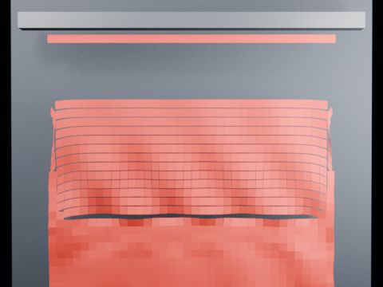

# Blender 5.2 Geometry Nodes Cloth Tearing

Blender 5.2 experimental node-powered Cloth Dynamics / XPBD tearing. A pinned cloth is pulled by gravity and validation requires an actual topology split.

- source commit: df8ed07325c2d245551c62af041a1d6c71f88537
- Actions run: 5 (36507852100)
- Blender: 5.2.2 LTS

[Play MP4](./media.mp4)

Validation JSON is stored in validation.json.
