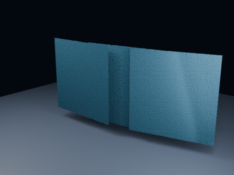

# Blender 5.2 Principled Thin Wall

Blender 5.2 Principled BSDF Thin Wall mode with transmissive zero-thickness panels.

- source commit: df8ed07325c2d245551c62af041a1d6c71f88537
- Actions run: 5 (36507852100)
- Blender: 5.2.2 LTS

[Play MP4](./media.mp4)

Validation JSON is stored in validation.json.
