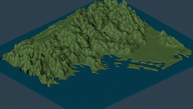

# yokohama-terrain-workbench-speed

Workbench preview benchmark for Yokohama terrain.

- 320×180
- 144 frames / 24 fps
- vertical exaggeration 1× → 32×
- engine: BLENDER_WORKBENCH
- render loop: 33.804 s
- average: 0.235 s/frame
- Actions run: https://github.com/2rwa/tmp-blender-52/actions/runs/36808490379

[Play MP4](./media.mp4)
